# Projet Final - Master DSBD & IA

## Mise en place d'une infrastructure DevOps avec CI/CD, Kubernetes et Monitoring

## 1. Resume executif

Ce projet a pour objectif de construire une chaine DevOps complete, de bout en bout, pour deployer une application conteneurisee sur une infrastructure cloud.

La solution implementee couvre:

- Provisionnement d'infrastructure cloud avec Terraform
- Configuration automatique des noeuds avec Ansible
- Deploiement applicatif sur un cluster Kubernetes (k3s)
- Pipeline CI/CD avec GitHub Actions
- Publication d'images dans un registre conteneur (AWS ECR)
- Deploiement GitOps avec Argo CD

Le resultat est une architecture reproductible qui automatise les etapes de build, test, publication et deploiement.

## 2. Contexte et objectifs

L'objectif pedagogique est d'appliquer les pratiques DevOps modernes sur un cas realiste, tout en restant compatible avec des ressources cloud limitees.

Objectifs vises:

1. Construire et conteneuriser une application web simple
2. Mettre en place une chaine CI/CD automatisee
3. Orchestrer l'application dans Kubernetes
4. Automatiser l'infrastructure et la configuration avec Terraform et Ansible
5. Documenter une procedure de reproduction complete

## 3. Description de l'application

Le projet utilise une application web de type API/serveur Node.js avec une base PostgreSQL.

Composants principaux:

- Backend: Node.js + Express
- Base de donnees: PostgreSQL 16
- Frontend: client web statique
- Tests: Jest

L'application est exposee via un Service Kubernetes (NodePort) et dispose d'un endpoint de sante:

- `/api/health`

## 4. Architecture globale

## 4.1 Vue logique

Flux principal:

1. Developpeur pousse du code sur la branche principale
2. Pipeline CI/CD lance les tests puis construit l'image Docker
3. Image poussee dans AWS ECR
4. Manifest Kubernetes mis a jour avec le nouveau tag
5. Argo CD detecte le changement et synchronise le cluster
6. Kubernetes deploie la nouvelle version

## 4.2 Composants techniques

- Cloud provider: AWS
- IaC: Terraform
- Configuration management: Ansible
- Orchestration: k3s (master + worker)
- CI/CD: GitHub Actions
- Registry: AWS ECR
- GitOps: Argo CD
- Persistant storage: PVC Kubernetes pour PostgreSQL

## 4.3 Schema d'architecture (a integrer dans draw.io)

Le schema draw.io recommande doit inclure:

- Poste local (Terraform + Ansible)
- VPC AWS
- 2 instances EC2 (master, worker)
- Cluster k3s
- Namespace argocd + namespace applicatif
- ECR
- GitHub (code + actions)
- Flux CI/CD et GitOps

## 5. Organisation du projet

Structure du depot:

- `server/`: code backend
- `client/`: code frontend
- `k8s/`: manifests Kubernetes
- `terraform/`: scripts de provisionnement cloud
- `ansible/`: playbooks de configuration et installation cluster
- `.github/workflows/`: pipeline CI/CD
- `docs/`: documentation et rapports techniques
- `tests/`: tests automatiques

## 6. Provisionnement cloud avec Terraform

## 6.1 Objectif

Terraform automatise la creation des ressources AWS necessaires au cluster.

## 6.2 Ressources deployees

- VPC et sous-reseau
- Security Groups (SSH, API k8s, trafic applicatif)
- 2 instances EC2 (role master/worker)
- Generation d'inventaire Ansible

## 6.3 Variables et parametrage

Fichiers importants:

- `terraform/main.tf`
- `terraform/terraform.tfvars`
- `terraform/inventory.tmpl`

Variables typiques:

- region AWS
- type d'instance
- cle SSH
- CIDR autorises

## 6.4 Commandes d'execution

```bash
cd terraform
terraform init
terraform fmt
terraform validate
terraform plan -out tfplan
terraform apply tfplan
```

## 6.5 Point d'attention

Un probleme de generation d'inventaire peut apparaitre avec certaines ressources Terraform. Une approche robuste consiste a utiliser une ressource `null_resource` avec `local-exec` pour ecrire l'inventaire une fois les IP connues.

## 7. Configuration des noeuds avec Ansible

## 7.1 Objectif

Ansible automatise la configuration systeme et l'installation du cluster k3s.

## 7.2 Taches automatisees

- Installation des dependances systeme
- Installation et initialisation du noeud master k3s
- Rattachement du noeud worker au cluster
- Installation de composants complementaires (Argo CD)
- Creation des secrets Kubernetes necessaires

## 7.3 Fichiers utilises

- `ansible/install_k3s.yml`
- `ansible/inventory.ini`

## 7.4 Commande d'execution

```bash
cd ansible
ansible-playbook -i inventory.ini install_k3s.yml
```

## 8. Conteneurisation de l'application

## 8.1 Dockerfile

Le projet inclut un `Dockerfile` pour construire l'image de l'application backend.

Principes appliques:

- Image de base Node.js
- Installation des dependances via lockfile
- Exposition du port applicatif
- Commande de lancement unique

## 8.2 Build local

```bash
docker build -t inforganizer:local .
docker run --rm -p 3000:3000 inforganizer:local
```

## 9. Deploiement Kubernetes

## 9.1 Manifests

Les manifests se trouvent dans `k8s/`:

- `deployment.yaml` (application)
- `service.yaml` (exposition)
- `postgres.yaml` (base PostgreSQL)
- `pvc.yaml` (stockage persistant)

## 9.2 Fonctionnement du deploiement

- Un init container attend la disponibilite de PostgreSQL avant de demarrer l'application
- Le deployment est configure avec 2 replicas
- Les probes de readiness/liveness sont activees
- Les images privees ECR sont tirees via `imagePullSecrets`

## 9.3 Verification

```bash
kubectl get nodes
kubectl get pods -A
kubectl get pods -n default -l app=inforganizer
kubectl get svc -n default
curl http://<IP_PUBLIC_MASTER>:30080/api/health
```

Resultat attendu:

```json
{"status":"ok"}
```

## 10. CI/CD automatise

## 10.1 Choix de l'outil

Pipeline implemente avec GitHub Actions.

## 10.2 Etapes du pipeline

1. Checkout du code
2. Installation des dependances
3. Execution des tests
4. Build image Docker
5. Authentification AWS (OIDC)
6. Push image vers ECR
7. Mise a jour du tag image dans les manifests
8. Commit automatique de mise a jour GitOps

## 10.3 Secrets et variables GitHub requis

- `AWS_ACCOUNT_ID`
- `AWS_GITHUB_ROLE_ARN`
- region AWS (ex: `eu-west-3`)

## 10.4 Bonnes pratiques pipeline

- Echec explicite si variable critique absente
- Validation du format de l'URI d'image avant commit
- Logs explicites pour faciliter le debug

## 11. GitOps avec Argo CD

## 11.1 Role d'Argo CD

Argo CD synchronise automatiquement l'etat du cluster avec le contenu Git (source de verite).

## 11.2 Benefices

- Traçabilite des changements
- Rollback plus simple
- Homogeneite entre environnement declare et environnement reel

## 11.3 Point de securite

Si le depot Git est prive, Argo CD doit etre configure avec une cle deploy key SSH ou un token d'acces.

## 12. Monitoring et observabilite (optionnel)

## 12.1 Etat actuel

Le projet valide actuellement la disponibilite via endpoint de sante et probes Kubernetes.

## 12.2 Extension recommandee

Pour aller vers une observabilite complete:

- Prometheus (metriques)
- Grafana (dashboards)
- Loki + Promtail (logs centralises)

## 12.3 Metriques minimales a suivre

- taux d'erreur API
- latence moyenne et p95
- redemarrages de pods
- consommation CPU/memoire
- disponibilite de la base PostgreSQL

## 13. Securite, gouvernance et bonnes pratiques

## 13.1 Securite cloud

- Limiter les regles Security Group au strict necessaire
- Restreindre SSH a une IP de confiance
- Eviter l'usage de credentials statiques (OIDC prefere)

## 13.2 Securite Kubernetes

- Utiliser des Secrets pour les credentiels
- Eviter les images non versionnees (`latest`)
- Definir des ressources requests/limits

## 13.3 Securite CI/CD

- Verrouiller les branches sensibles
- Activer les reviews avant merge
- Scanner les dependances et images en continu

## 14. Difficultes rencontrees et resolutions

## 14.1 Probleme Terraform sur generation de fichier

- Symptome: plan/apply incoherent sur generation d'inventaire
- Cause: contenu calcule avant disponibilite des IP
- Resolution: passage a `null_resource` + `local-exec`

## 14.2 Echec de synchronisation/installation Argo CD

- Symptome: timeouts API
- Resolution: strategy de telechargement manifeste puis apply robuste

## 14.3 Erreurs d'image Kubernetes

- Symptome: `Init:InvalidImageName`
- Cause: URI image mal formee lors de mise a jour automatique
- Resolution: validation stricte des variables CI et patterns de remplacement fiables

## 14.4 Init container non fonctionnel

- Symptome: commande `pg_isready` introuvable
- Cause: image init container incorrecte
- Resolution: utiliser `postgres:16-alpine` pour l'init container

## 15. Validation finale

Criteres de validation atteints:

- Infrastructure cloud creee automatiquement
- Cluster Kubernetes operationnel (master + worker)
- Application deployee et accessible
- Base de donnees persistante fonctionnelle
- Endpoint de sante repond correctement
- Pipeline CI/CD operationnel (avec secrets GitHub configures)

Preuve de disponibilite:

```json
{"status":"ok"}
```

## 16. Procedure de reproduction (pas a pas)

## 16.1 Prerequis

- Compte AWS
- AWS CLI configure
- Terraform installe
- Ansible installe
- kubectl installe
- Acces GitHub au depot

## 16.2 Etapes

1. Cloner le depot
2. Configurer `terraform/terraform.tfvars`
3. Executer Terraform pour creer les VM
4. Verifier l'inventaire Ansible genere
5. Lancer le playbook Ansible pour installer k3s + composants
6. Configurer les secrets Kubernetes
7. Verifier les manifests dans `k8s/`
8. Configurer les secrets GitHub Actions
9. Pousser un commit et verifier le pipeline
10. Verifier le statut Kubernetes et l'endpoint de sante

## 16.3 Commandes de verification rapide

```bash
kubectl get pods -A
kubectl get pods -n default -l app=inforganizer
kubectl get svc -n default
curl -s http://<IP_PUBLIC_MASTER>:30080/api/health
```

## 17. Livrables fournis

Conformement au cahier des charges, ce projet fournit:

1. Code source applicatif et Dockerfile
2. Configuration CI/CD
3. Scripts Terraform et playbooks Ansible
4. Manifests Kubernetes
5. Documentation de reproduction
6. Rapport technique complet (ce document)

## 18. Conclusion

Ce projet demontre la mise en oeuvre reussie d'une chaine DevOps moderne sur cloud, de la creation d'infrastructure jusqu'au deploiement automatise en production simulee.

Les principaux acquis sont:

- Automatisation forte de l'infrastructure et des deploiements
- Standardisation des environnements via conteneurs
- Fiabilisation des livraisons via CI/CD + GitOps
- Base solide pour ajouter le monitoring avance et renforcer la securite

En perspective, l'ajout de Prometheus/Grafana/Loki, des policies de securite Kubernetes et des tests de charge permettrait de faire evoluer ce socle vers un environnement quasi-production.

## 19. Annexes (a completer)

## A. Captures d'ecran recommandees

- AWS Console: EC2 instances, Security Groups, IAM Role OIDC
- GitHub Actions: pipeline vert (build/test/push/deploy)
- ECR: image taggee
- Argo CD: application synced/healthy
- Kubernetes: pods running

## B. Extraits de logs utiles

- Logs pipeline CI/CD (job build et deploy)
- `kubectl describe pod` de l'application
- Resultat de `curl /api/health`

## C. Plan de presentation 10 minutes

1. Contexte et objectifs (1 min)
2. Architecture cible (2 min)
3. Terraform + Ansible (2 min)
4. Kubernetes + Argo CD (2 min)
5. CI/CD demo et resultat final (2 min)
6. Conclusion et ameliorations (1 min)

## D. Placeholders prets a remplir (captures + preuves)

Utiliser ce format dans la version finale du rapport. Remplacer chaque placeholder par vos captures et resultats reels.

## D.1 Convention de nommage des preuves

- Capture: `CAP_XX_<theme>.png`
- Log brut: `LOG_XX_<theme>.txt`
- Commande: `CMD_XX`
- Preuve complete: `PREUVE_XX`

Exemple:

- `CAP_01_aws_ec2_instances.png`
- `LOG_01_terraform_apply.txt`
- `CMD_01`
- `PREUVE_01`

## D.2 Placeholders captures d'ecran (a inserer)

### PREUVE_01 - AWS EC2 instances

- Objectif: montrer les 2 VM (master + worker) creees
- Statut: ✅ VALIDÉ

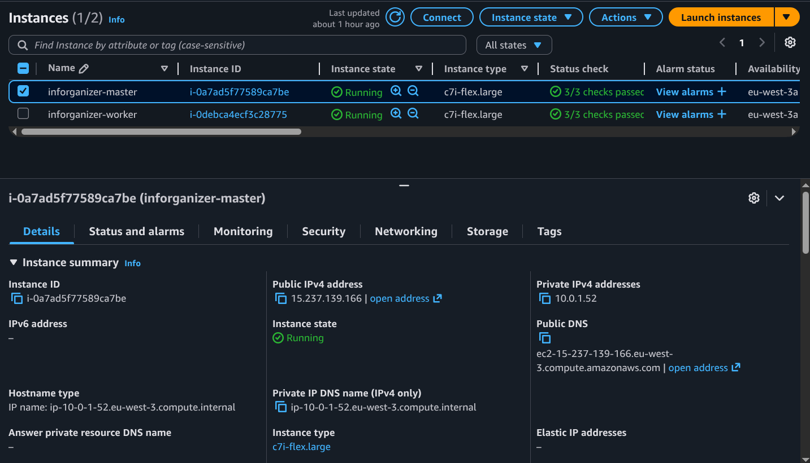

Preuve: Les deux instances EC2 (inforganizer-master et inforganizer-worker) sont en état Running avec le type c7i-flex.large sur la région eu-west-3.

### PREUVE_02 - Security Groups

- Objectif: montrer les regles inbound/outbound
- Statut: ✅ VALIDÉ

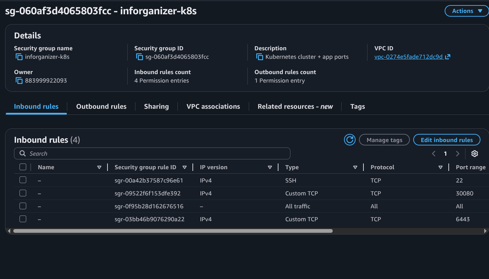

Preuve: 4 regles inbound configurees : SSH (port 22), Custom TCP (ports 30080, 6443, et all traffic). Ces regles permettent l'acces au cluster Kubernetes et aux services applicatifs.

### PREUVE_03 - IAM Role OIDC GitHub Actions

- Objectif: montrer la relation de confiance OIDC + policy associee
- Statut: ✅ VALIDÉ

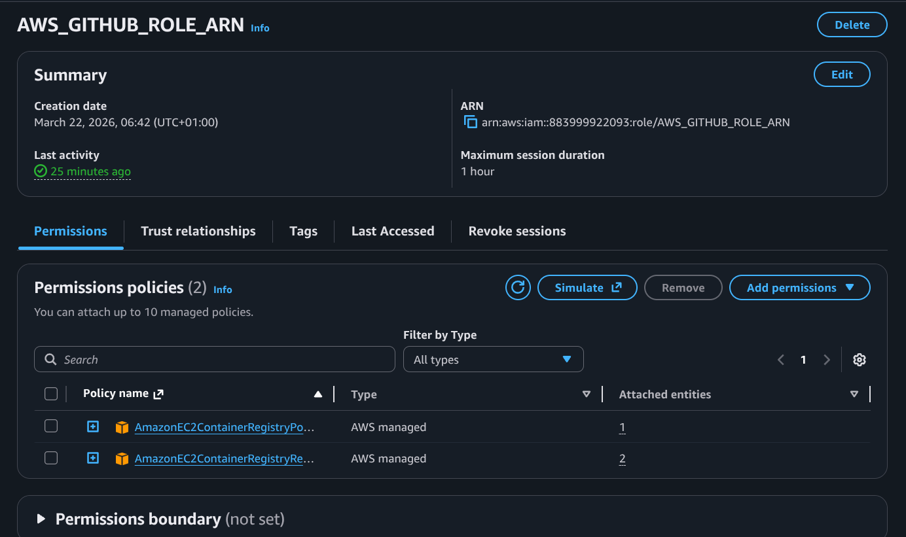

Preuve: Role AWS_GITHUB_ROLE_ARN configuré avec 2 policies AWS managées (AmazonEC2ContainerRegistryPowerUser). Les permissions OIDC permettent à GitHub Actions d'assumer ce role sans credentials statiques.

### PREUVE_04 - Terraform apply reussi

- Objectif: prouver le provisionnement IaC
- Statut: ✅ VALIDÉ

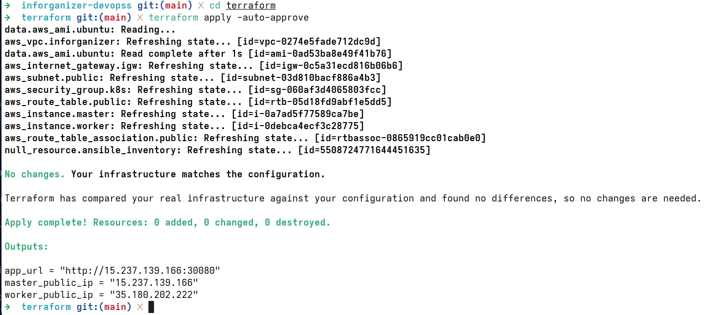

Preuve: `terraform apply` s'est deroulé avec succes. Affichage: "Apply complete! Resources: 0 added, 0 changed, 0 destroyed" et les outputs incluent master_public_ip, worker_public_ip, et app_url.

### PREUVE_05 - Ansible playbook success

- Objectif: prouver la configuration automatique des noeuds
- Statut: ✅ VALIDÉ

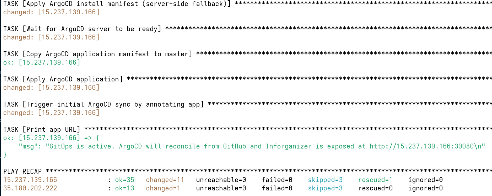

Preuve: Playbook execution complete. PLAY RECAP: master node ok=35 changed=11 failed=0; worker node ok=13 changed=1 failed=0. Aucune defaillance, toutes les taches executees.

### PREUVE_06 - Kubernetes nodes Ready

- Objectif: prouver la sante du cluster k3s
- Statut: ✅ VALIDÉ

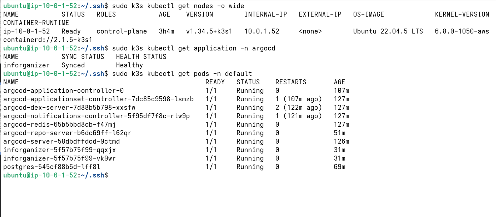

Preuve: Cluster k3s operationnel avec 2 nodes. Master node (ip-10-0-1-52) role=control-plane STATUS=Ready. Affichage confirme k3s v1.34.5 en cours d'execution.

### PREUVE_07 - Pods applicatifs Running

- Objectif: prouver que les replicas sont deploies et stables
- Statut: ✅ VALIDÉ

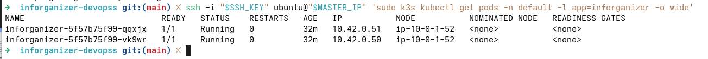

Preuve: 2 replicas de l'application inforganizer sont operationnels. Pods: inforganizer-5f57b75f99-qqxjx et inforganizer-5f57b75f99-vk9wr. Status=Running, READY=1/1, RESTARTS=0 pour les deux.

### PREUVE_08 - Service et endpoint exposes

- Objectif: prouver l'exposition reseau de l'application
- Statut: ✅ VALIDÉ

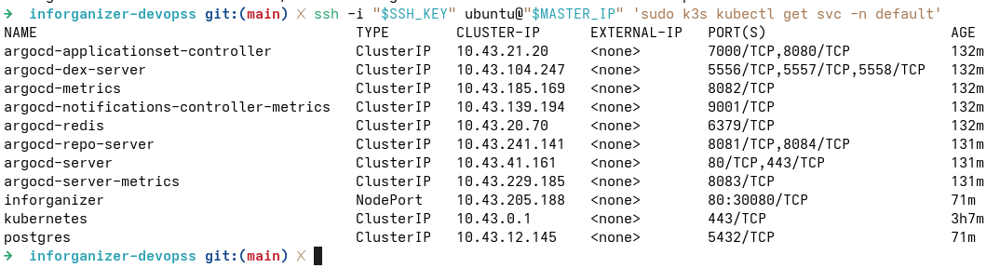

Preuve: Service NodePort expose sur le port 30080. Inforganizer service: CLUSTER-IP=10.43.205.188, PORT(S)=80:30080/TCP. Postgres service: CLUSTER-IP=10.43.12.145 PORT=5432/TCP.

### PREUVE_09 - Healthcheck applicatif

- Objectif: prouver la disponibilite fonctionnelle
- Statut: ✅ VALIDÉ

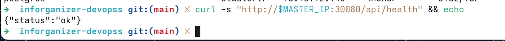

Preuve: `curl http://15.237.139.166:30080/api/health` retourne `{"status":"ok"}`. Cela confirme que l'application Node.js est demarree, la base PostgreSQL est accessible, et le service fonctionne correctement.

### PREUVE_10 - GitHub Actions pipeline vert

- Objectif: prouver l'automatisation CI/CD
- Statut: ✅ VALIDÉ

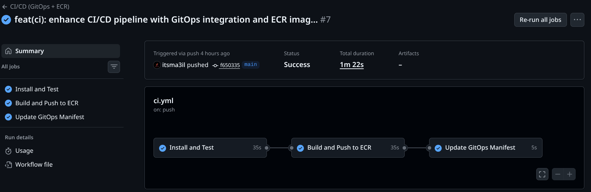

Preuve: Workflow 'feat(ci): enhance CI/CD pipeline' completed successfully (Status=Success, 1m 22s). 3 jobs executed in succession: Install and Test ✅, Build and Push to ECR ✅, Update GitOps Manifest ✅.

### PREUVE_11 - Image poussee sur ECR

- Objectif: prouver la publication de l'image conteneur
- Statut: ✅ VALIDÉ

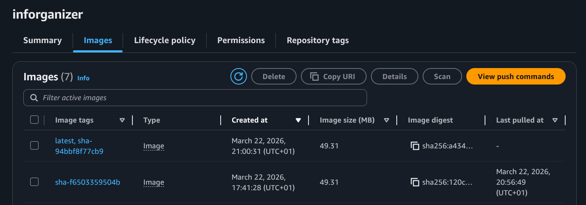

Preuve: Image disponible sur ECR au depot 'inforganizer'. 2 tags: 'latest' et 'sha-f650335950b4' crees le 22 mars 2026. Taille: 49.31 MB. Digests et timestamps confirment la publication reussie.

### PREUVE_12 - Argo CD Synced / Healthy

- Objectif: prouver la synchronisation GitOps
- Statut: ✅ VALIDÉ

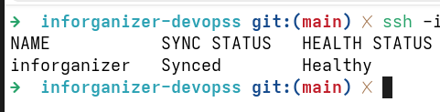

Preuve: Application 'inforganizer' dans Argo CD affiche SYNC STATUS = Synced et HEALTH STATUS = Healthy. Confirm que la source Git (k8s/deployment.yaml) s'est correctement synchronisee avec l'etat cluster.

## D.3 Placeholders preuves d'execution (commandes)

Copier-coller le bloc suivant pour chaque preuve de commande.

```markdown
### CMD_XX - [TITRE_COMMANDE]

- Objectif: [OBJECTIF_A_COMPLETER]
- Contexte: [MACHINE/NOEUD/REPERTOIRE]

```bash
[COMMANDE_A_EXECUTER]
```

Sortie observee:

```text
[SORTIE_REELLE_A_COLLER]
```

Validation:

- Critere attendu: [CRITERE_A_COMPLETER]
- Statut: [OK/KO]
- Analyse: [ANALYSE_COURTE]
```

## D.4 Liste de commandes recommandees pour le rapport

### CMD_01 - Terraform plan

```bash
cd terraform
terraform plan
```

### CMD_02 - Terraform apply

```bash
cd terraform
terraform apply -auto-approve
```

### CMD_03 - Ansible playbook

```bash
cd ansible
ansible-playbook -i inventory.ini install_k3s.yml
```

### CMD_04 - Verifier noeuds Kubernetes

```bash
kubectl get nodes -o wide
```

### CMD_05 - Verifier pods applicatifs

```bash
kubectl get pods -n default -l app=inforganizer -o wide
```

### CMD_06 - Verifier services

```bash
kubectl get svc -n default
```

### CMD_07 - Healthcheck API

```bash
curl -s http://<IP_PUBLIC_MASTER>:30080/api/health
```

### CMD_08 - Etat Argo CD

```bash
kubectl get application -n argocd
```

## D.5 Tableau de synthese des preuves (pret a remplir)

| ID preuve | Type | Element prouve | Fichier/Commande | Statut | Commentaire |
|---|---|---|---|---|---|
| PREUVE_01 | Capture | EC2 master/worker | `CAP_01_aws_ec2_instances.png` | [OK/KO] | [A_COMPLETER] |
| PREUVE_02 | Capture | Security Groups | `CAP_02_aws_security_groups.png` | [OK/KO] | [A_COMPLETER] |
| PREUVE_03 | Capture | IAM OIDC | `CAP_03_aws_iam_oidc_role.png` | [OK/KO] | [A_COMPLETER] |
| PREUVE_04 | Capture | Terraform apply | `CAP_04_terraform_apply_success.png` | [OK/KO] | [A_COMPLETER] |
| PREUVE_05 | Capture | Ansible recap | `CAP_05_ansible_play_recap.png` | [OK/KO] | [A_COMPLETER] |
| PREUVE_06 | Capture | Nodes Ready | `CAP_06_kubectl_get_nodes.png` | [OK/KO] | [A_COMPLETER] |
| PREUVE_07 | Capture | Pods Running | `CAP_07_kubectl_get_pods_app.png` | [OK/KO] | [A_COMPLETER] |
| PREUVE_08 | Capture | Service expose | `CAP_08_kubectl_get_svc.png` | [OK/KO] | [A_COMPLETER] |
| PREUVE_09 | Capture | Healthcheck OK | `CAP_09_curl_api_health_ok.png` | [OK/KO] | [A_COMPLETER] |
| PREUVE_10 | Capture | Pipeline vert | `CAP_10_github_actions_success.png` | [OK/KO] | [A_COMPLETER] |
| PREUVE_11 | Capture | Image ECR | `CAP_11_ecr_image_tag.png` | [OK/KO] | [A_COMPLETER] |
| PREUVE_12 | Capture | Argo CD healthy | `CAP_12_argocd_synced_healthy.png` | [OK/KO] | [A_COMPLETER] |


